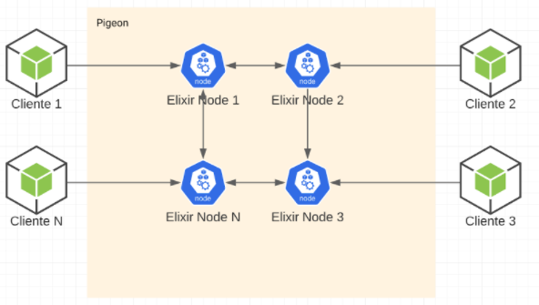

# Pigeon

## Arquitectura a alto nivel



En el presente documento se indica como levantar la plataforma Pigeon con 3 nodos.

## Cómo correr Pigeon

### 1 - Levantar el clúster
En una primera consola, se debe ejecutar:
```bash
PORT=4000 iex --sname server1@localhost -S mix
```

Y en otras dos terminales distintas:
```bash
PORT=4001 iex --sname server2@localhost -S mix
```
```bash
PORT=4002 iex --sname server3@localhost -S mix
```

Una vez ejecutada estos tres comandos ya se encuentra disponible para interactuar con el sistema Pigeon.

De más está decir, que se podrán agregar más nodos al clúster mientras tengan un `sname` distinto.

### 2 - Crear usuarios
Para poder conectar clientes, es necesario crear los UserRegistry en el WebServer.

Por ejemplo:
```elixir
Pigeon.UserRegistry.create_user(:martin)
```
```elixir
Pigeon.UserRegistry.create_user(:jesica)
```
### 3 - Conectar clientes
Una vez que creamos los UserRegistry, ya podemos conectarnos a través de los clientes websockets.

A nivel del directorio `/client`:
```bash
npm install
```
Luego:
```bash
npm run client <user>
```
Donde `user` debe ser un usuario que ya tiene creado un UserRegistry en el WebServer.

Por ejemplo, nosotros creamos a UserRegistry `:martin` por lo tanto nos conectaremos:
```bash
npm run client martin
```
### 4 - Enviar funciones
Dentro de la consola levantada por el comando `npm run client <user>`, podremos enviar a ejecutar las funciones que nos comunican con el sistema Pigeon. Las funciones que están disponibles actualmente son:
* `create_group_room <room>`
* `create_chat <user>`
* `create_secret_room <user>`
* `add_user <user> <room>`
* `remove_user <room> <user>`
* `get_user_info <room> <user>`
* `upgrade_user <room> <user>` 
* `send_message_to_room <room> <text> [<ttl>]`
* `list_messages <room>`
* `edit_message <room> <message_id> <text>`
* `delete_message <room> <message_id>`

> Disclaimer: actualmente el cliente websocket no es tan flexible a la hora de enviar un mensaje. Por lo que si queremos enviar un texto que contiene espacios, debemos hacerlo reemplazando los espaciones por `_` por ejemplo.